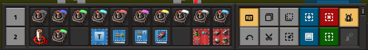

# splatoon

`chmod +x splatoon.py`

Bind a key combination to run the program. Here is an i3 example:

`bindsym $mod+Shift+Ctrl+s exec "/usr/bin/python3 /home/buddy/splatoon/splatoon.py"`

Run your keybind, click 2 points on the mapview with all 10 spiders bound and set in your hotbar:



Now you can do anything!

```
usage: splatoon.py [-h] [-s SPIDERS] [-p PAUSE]

optional arguments:
  -h, --help            show this help message and exit
  -s SPIDERS, --spiders SPIDERS
                        Number of spidertrons
  -p PAUSE, --pause PAUSE
                        Pause after each PyAutoGUI call
```